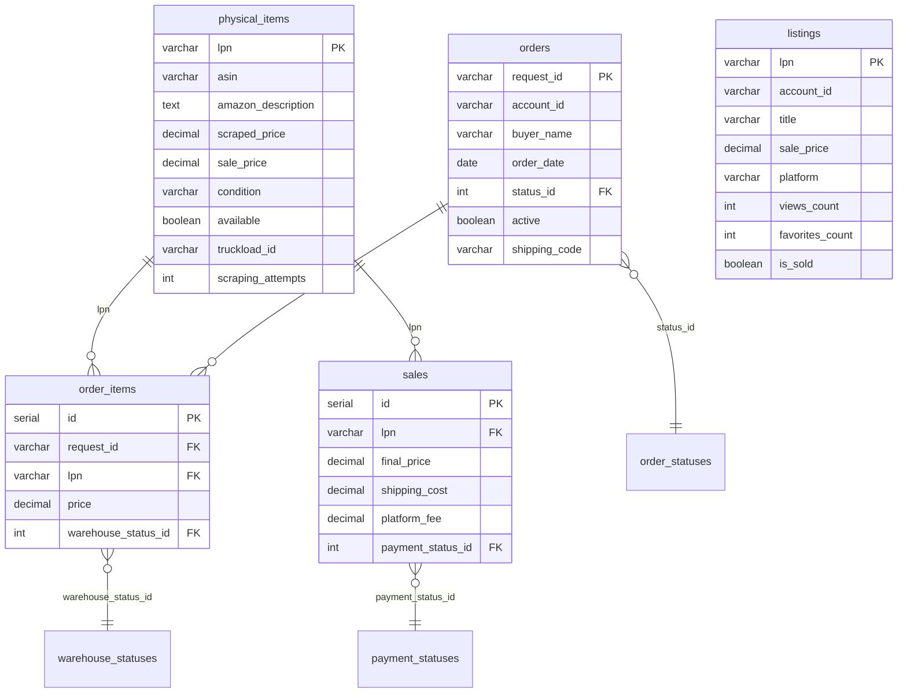

# Inventory Operations API


FastAPI REST API for multi-platform inventory management — handles physical items, marketplace listings, orders, and sales tracking across platforms like Wallapop, Vinted, and custom e-commerce channels.

## Architecture



## API Endpoints

| Method | Endpoint | Description |
|--------|----------|-------------|
| `GET` | `/health` | Service health check |
| `GET` | `/api/v1/items` | List items with pagination and filtering |
| `GET` | `/api/v1/items/stats` | Inventory summary statistics |
| `GET` | `/api/v1/items/{lpn}` | Get single item by LPN |
| `POST` | `/api/v1/items` | Create new item |
| `PATCH` | `/api/v1/items/{lpn}` | Partial update item |
| `GET` | `/api/v1/orders` | List orders with filtering |
| `GET` | `/api/v1/orders/{request_id}` | Order detail with items |
| `PATCH` | `/api/v1/orders/{request_id}/status` | Update order status |
| `GET` | `/api/v1/listings` | List listings with filtering |
| `GET` | `/api/v1/listings/performance` | Aggregated engagement metrics |

## Quick Start

### Local Setup

```bash
# Clone and install dependencies
git clone https://github.com/AspiranteD/inventory-ops-api.git
cd inventory-ops-api
python -m venv .venv && source .venv/bin/activate  # or .venv\Scripts\activate on Windows
pip install -r requirements.txt

# Configure environment
cp .env.example .env
# Edit .env with your PostgreSQL credentials

# Run the server
uvicorn src.api.app:app --reload --host 0.0.0.0 --port 8000
```

### Run Tests

```bash
python -m pytest tests/ -v
```

Tests use SQLite in-memory — no external database required.

## Usage Examples

```bash
# Create an item
curl -X POST http://localhost:8000/api/v1/items \
  -H "Content-Type: application/json" \
  -d '{"lpn": "LPN-001", "asin": "B08N5WRWNW", "condition": "new", "sale_price": 29.99}'

# List available items filtered by condition
curl "http://localhost:8000/api/v1/items?condition=new&available=true&page_size=10"

# Get inventory stats
curl http://localhost:8000/api/v1/items/stats

# Update order status (with validation)
curl -X PATCH http://localhost:8000/api/v1/orders/ORD-001/status \
  -H "Content-Type: application/json" \
  -d '{"status_id": 2, "notes": "Processing started"}'

# Get listing performance metrics
curl http://localhost:8000/api/v1/listings/performance
```

## Design Decisions

**Why FastAPI?** Automatic OpenAPI docs, native async support, Pydantic validation, and dependency injection — ideal for data-heavy inventory APIs that need strict schema enforcement.

**Why SQLModel over raw SQLAlchemy?** SQLModel unifies Pydantic models with SQLAlchemy tables, eliminating the duplication between ORM models and API schemas. Single source of truth for field types and constraints.

**Why a service layer?** Separating business logic (status transition validation, stats aggregation) from route handlers keeps endpoints thin and testable. Services can be reused across CLI scripts and background jobs.

**Unified status model:** Dimension tables for order/warehouse/payment statuses allow adding new states without schema migrations. Status transitions are validated in the service layer with explicit allowed-transition maps.

## Project Structure

```
src/
├── api/          # FastAPI app, routes, dependency injection
├── models/       # SQLModel table definitions
├── schemas/      # Pydantic request/response models
├── services/     # Business logic layer
└── db/           # Database engine and session management
```

## Related Repositories

- [reusalia-scraping](https://github.com/AspiranteD/reusalia-scraping) — Product data scraping pipelines
- [listing-automation](https://github.com/AspiranteD/listing-automation) — Multi-platform listing management

## License

MIT
